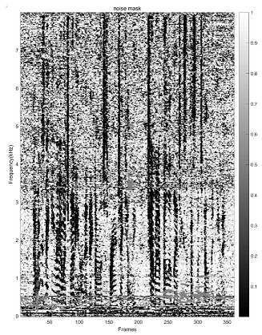

## Notes

Implementation of CGMM mask estimation in MATLAB(final version).

Previous one in [CGMM-MVDR](https://github.com/funcwj/CGMM-MVDR)

### Examples
mask for F05_447C0212_CAF.CH{1,2,3,4,5,6} in CHiME4 et05_caf_real

### Reference
T. Higuchi, N. Ito, T. Yoshioka, and T. Nakatani, "Robust mvdr beamforming using time-frequency masks for online/offline asr in noise," in ICASSP, 2016.